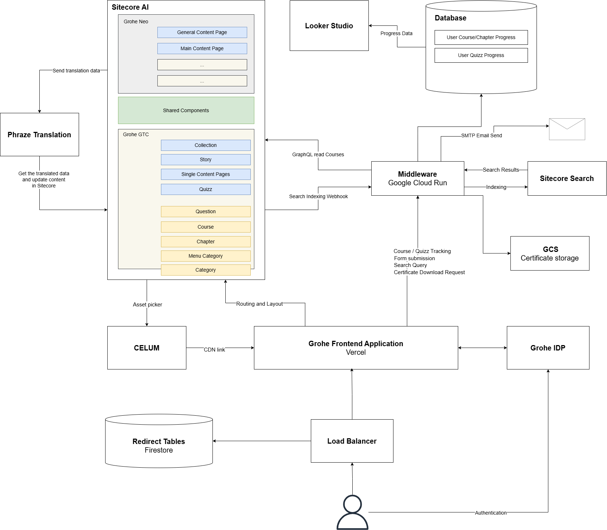
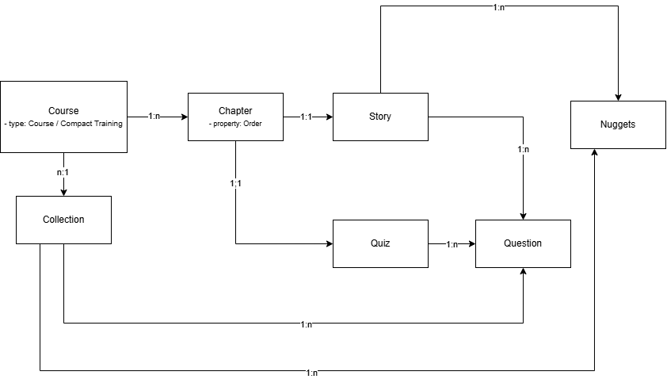

# Solution Overview — GROHE Training Companion (GTC)

**Project:** GTC Migration — Craft CMS → Sitecore AI (NEO)
**Document owner:** Artsiom Dylevich, Solution Architect, Actum Digital
**Version:** 1.0 — Discovery Phase deliverable
**Date:** 28 February 2026
**Status:** Draft for review

---

## Table of Contents

1. [Executive Summary](#1-executive-summary)
2. [Current State — Craft CMS](#2-current-state--craft-cms)
3. [Proposed Architecture](#3-proposed-architecture)
4. [Sitecore Content Model](#4-sitecore-content-model)
5. [Component Mapping & Gap Analysis](#5-component-mapping--gap-analysis)
6. [Feature Specifications Summary](#6-feature-specifications-summary)
7. [Integrations Detail](#7-integrations-detail)
8. [Progress Tracking & Reporting](#8-progress-tracking--reporting)
9. [Infrastructure & Hosting](#9-infrastructure--hosting)
10. [Migration Overview](#10-migration-overview)
11. [Out of Scope](#11-out-of-scope)
12. [Open Items & Decisions Required](#12-open-items--decisions-required)

---

## 1. Executive Summary

**GROHE Training Companion (GTC)** is GROHE's digital training platform at [training.grohe.com](https://training.grohe.com), serving installers, designers, kitchen studios, showroom staff, and GROHE/Lixil internal employees across 19 languages. The platform delivers structured training modules (Collections), compact training content, and quizzes — including PDF certificate generation upon course completion.

GTC was built and maintained by agency **THIS GmbH**, which closed in December 2025. Craft CMS V4 Long-Term Support and THIS's remaining contractual support both expire in **June 2026**, creating an immovable hard deadline for migration. GROHE does not hold the source code (retained in THIS's private repository), and post-closure maintenance capacity is minimal.

### Selected Approach

Rather than rebuilding GTC as a standalone system, the selected approach is to **extend the existing NEO (Sitecore AI) ecosystem** to host GTC as a second site within the same Sitecore AI instance. This aligns with Lixil's one-platform strategy and delivers concrete advantages:

- **Shared infrastructure** — GCP hosting, IDP, CDN, search, and media management (Celum) already in production for NEO
- **Shared IDP** — no user or role migration required; the same GROHE IDP that NEO uses will authenticate GTC users
- **Component reuse** — 13 of 28 assessed components are directly reusable from NEO; 6 require adaptation; 9 require custom development (primarily the quiz/question types)
- **Reporting continuity** — Craft currently connects to Looker Studio via an API connector; GTC sets up an equivalent Cloud SQL (PostgreSQL) → Looker Studio connector to keep existing reports fully functional

### What Is in Scope

| Area | Scope |
|---|---|
| Content model + components | All 28 mapped; custom development for 9 quiz types |
| Integrations | IDP (REUSE), Celum (EXTEND), Phrase TMS (EXTEND), Sitecore Search (EXTEND), Redirects (data provision only), Cloud SQL / GCS (NEW) |
| Progress tracking & reporting | Cloud SQL → Looker Studio connector (replacing existing Craft DB → Looker connector) |
| Certificate generation | On-request PDF generation with GCS storage |
| Feedback forms | End-of-course and footer feedback (email delivery, no DB storage) |
| Content migration | ~60 trainings, 19 languages, all media to Celum |
| Historical progress data | Migration of existing course + quiz tracking records |

### What Is Out of Scope

Full LMS integration, Salesforce / Marketing Cloud, behavioral personalization, redirect service maintenance, and Hetzner infrastructure migration are explicitly excluded from this phase (see [Section 11](#11-out-of-scope)).

---

## 2. Current State — Craft CMS

### Technical Stack

| Component | Technology |
|---|---|
| CMS / Backend | Craft CMS 4.x + custom caching layer + JSON REST API |
| Frontend | Nuxt.js SPA (NodeJS app consuming JSON API) |
| Search | Elasticsearch 7.17 (Docker containerized) |
| Database | MariaDB 10.11 (~3 GB compressed, ~15 GB raw) |
| Hosting | Hetzner Cloud, Nuremberg (16 vCPU, 64 GB RAM, 360 GB) |
| Web server | Caddy on Ubuntu 24.04 |
| Monitoring | Prometheus + Grafana |
| Network | Cloudflare proxy (frontend) + Tailscale (SSH/admin) |
| Authentication | GROHE IDP (SSO) for end users; Craft CMS user management for editors |

### Content Model

```
Collection (page — /collections/<slug>)
  └─ Course (data item — type: Course | Compact Training)
       └─ Chapter (data item, ordered)
            └─ Story (page — navigable, sub-URL of Collection)
                 └─ Nugget (component rendered on Story page)

Quiz (page — /quizzes/<slug>)
  └─ Questions (data items)
     — linked 1:1 to Chapter; also accessible directly from Collection
```

URL prefixes in Craft: `collections/` for standard training modules, `playlists/` for compact trainings, `quizzes/` for quizzes.

### Content Scale

| Dimension | Value |
|---|---|
| Trainings (Collections) | ~60 (2–3 to be deprecated; 2 new launching April 2026) |
| Languages | 19 |
| Active learners (course tracking) | ~552 users |
| Active learners (quiz tracking) | ~591 users |
| Active content editors | ~10 |
| Backend Lixil users | ~47 |
| New trainings per year | 10–12 |

### Media Inventory

All media assets are stored in Craft CMS — **not in Celum**. Migration to Celum is required as part of this project.

| Type | Count | Size |
|---|---|---|
| Images | 7,625 | 3.7 GB |
| Videos | 825 | 5.8 GB |
| Files | 173 | 1.1 GB |
| Audio | 1 | 1 MB |
| Transformed images | — | ~25 GB |
| Database | — | ~3 GB |
| Cache | — | ~21 GB |

### Active Integrations

| Integration | Current Implementation |
|---|---|
| GROHE IDP | OAuth2 SSO for end users |
| Looker Studio | API connector from Craft DB (tables: `GTC_Quiz_Statistics`, `GTC_Course_Statistics`, `GTC_User_Export`) |
| Phrase TMS | Manual Excel import/export for translations |
| Cloudflare | CDN / proxy for the frontend |
| Google Analytics / GTM | Tracking and campaign measurement |
| Elasticsearch | Internal search (containerized, private) |

### Key Limitations Driving Migration

- Agency THIS GmbH closed; source code is not owned by GROHE
- Craft V4 LTS expires April 2026; THIS support expires June 2026
- Platform is isolated from LIXIL IT standards (Hetzner, not GCP)
- Reporting uses an API connector to Craft DB tables — functional but tightly coupled to Craft schema
- Translation requires manual Excel workflow — no live Phrase API
- Caching architecture (140 cache combinations) is complex and requires expert knowledge to manage

---

## 3. Proposed Architecture

### Architecture Diagram



*Note: The Load Balancer + Firestore redirect layer sits in front of the Frontend Application (not shown in diagram for clarity — see [Section 7, Redirects](#load-balancer--redirect-tables-extend--data-provision-only)).*

### Multisite Model

GTC will run as a **second site within the existing Sitecore AI instance** that already hosts Grohe NEO (www.grohe.com). This is a standard Sitecore AI multisite configuration:

- Both sites share the same Sitecore instance, content tree structure, and component library
- Components (Nuggets in Craft = Sitecore components) are reused or restyled across both sites
- GTC-specific components and data templates are scoped to the GTC site
- Grohe NEO is already in production; GTC is added as the second site

### System Components

| Component | Technology | Role | Type |
|---|---|---|---|
| CMS | Sitecore AI | Content authoring + layout management | REUSE |
| Frontend | Next.js on Vercel | Page rendering + user interaction (multisite) | EXTEND |
| Middleware | Google Cloud Run (GCR) | Business logic, APIs, certificate generation | EXTEND |
| Database | Cloud SQL — PostgreSQL | User progress, quiz results | NEW |
| Reporting | Looker Studio | Cloud SQL connector (replaces existing Craft DB connector) | NEW |
| Certificate storage | Google Cloud Storage (GCS) | Immutable PDF storage, Signed URL access | NEW |
| Search | Sitecore Search | Full-text course/chapter/quiz search | EXTEND |
| Media | Celum DAM | Asset picker (authoring) + CDN (rendering) | EXTEND |
| Authentication | GROHE IDP | OAuth2 SSO for all users | REUSE |
| Translation | Phrase TMS | Direct Sitecore connector for content translation | EXTEND |
| Redirects | GCP Load Balancer + Firestore | URL redirect lookup (old Craft slugs → new Sitecore slugs) | EXTEND |

**Integration type key:**
- **NEW** — built specifically for GTC; does not exist in NEO
- **EXTEND** — existing NEO integration being configured or extended for GTC content types
- **REUSE** — used by GTC unchanged from NEO

---

## 4. Sitecore Content Model

### Content Entity Diagram



*The diagram above reflects the source Craft CMS entity structure. The Sitecore model maps directly to these entities with equivalent types.*

### Item Hierarchy

| Item | Sitecore Item Type | Has URL (Navigable) | Notes |
|---|---|---|---|
| Collection | Content Page | Yes — `/collection/<slug>` | Top-level training module |
| Story | Content Page | Yes — child URL under Collection | Individual lesson page |
| Single Content Pages | Content Page | Yes | Standalone informational pages |
| Quiz | Content Page | Yes — `/quiz/<slug>` | Linked to Chapter; accessible from Collection |
| Course | Data Item | No | Defines type (Course / Compact Training); underpins Collection |
| Chapter | Data Item | No | Ordered grouping; links Story to Collection |
| Question | Data Item | No | Child of Quiz; defines question type and answer options |
| Menu Category | Data Item | No | Navigation structure |
| Components (Nuggets) | Shared Component | No | Rendered on Story and Collection pages |

### Shared Components

Sitecore components corresponding to Craft's "Nuggets" are defined once and can be placed on pages in both Grohe NEO and Grohe GTC. This is a core benefit of the multisite model: GTC benefits from the NEO component library out of the box, and newly built GTC-specific components (e.g., quiz question types) are scoped to the GTC site unless a business case exists to promote them to both sites.

---

## 5. Component Mapping & Gap Analysis

**Summary: 28 components assessed across three categories.**

| Category | Total | ✅ Reusable | ⚙ Adaptation needed | 🚫 Custom development |
|---|---|---|---|---|
| Basics | 11 | 10 | 1 | 0 |
| Interactions | 9 | 3 | 5 | 1 |
| Quiz / Question Types | 8 | 0 | 0 | 8 |
| **Total** | **28** | **13** | **6** | **9** |

### Category 1 — Basics (11 components, ~90% reusable)

| # | GTC Component | NEO Equivalent | Status | Notes |
|---|---|---|---|---|
| 1 | Stage / Hero Banner | Hero Banner | ✅ | NEO adds video support and dual buttons |
| 2 | Text / Text Block | Text Block | ✅ | Supports 2/3-column options and buttons |
| 3 | Text/Media / Content Display Block | Content Display Block | ✅ | Various image placements and backgrounds |
| 4 | Text/Media Breakdown | Content Display Block | ✅ | Same component; no exact offset layout |
| 5 | Editorial Text | Promo Banner | ⚙ | GTC has scrolling animation (brand-story pages); NEO is static only |
| 6 | Multicolumn / Info Block | Info Block | ✅ | Small images, multiple columns, buttons, Show More |
| 7 | Blockquote with Image | Quote | ✅ | Same structure; minor visual differences |
| 8 | Blockquote | Quote | ✅ | Quote + author only |
| 9 | Checklist | Info Block — Icons | ✅ | No dedicated checklist; Info Block with Icons is the best fit |
| 10 | Table | Table | ✅ | NEO Table becomes accordion on mobile |
| 11 | Download List | Downloads | ✅ | NEO adds document preview and request-document option |

**Assessment:** Minor visual differences only; all 10 reusable components can be adopted directly.

### Category 2 — Interactions (9 components, mixed)

| # | GTC Component | NEO Equivalent | Status | Notes |
|---|---|---|---|---|
| 1 | A/B Slider | Media Gallery | ⚙ | Before/after drag handle not in NEO; adaptation of Media Gallery required |
| 2 | Slideshow | Media Cards Carousel / Tabs | ⚙ | No exact equivalent; adaptation from carousel needed |
| 3 | Text Slider | Media Cards Carousel / Tabs | ⚙ | Same assessment as Slideshow |
| 4 | Marquee Slider | Masonry Gallery | ✅ | Media Gallery is alternative; functionally equivalent |
| 5 | Teaser List | Media Cards Carousel | ✅ | Covers same capability with flexible media support |
| 6 | Accordion | Accordion | ⚙ | NEO Accordion accepts only rich text, image, video — not teasers |
| 7 | Tabs Content | Tabs + Content Display Block | ✅ | Almost every NEO component can be placed inside NEO Tabs |
| 8 | Image Tabs | Tabs | ⚙ | Only text-based tabs exist in NEO; image-as-tab-label requires adaptation |
| 9 | Hotspots | Image with Hotspots | ⚙ | NEO-398 deployed in production; initial content is product-related only — GTC-specific customization required |

### Category 3 — Quiz / Question Types (8 components, ALL custom development)

| # | GTC Component | NEO Equivalent | Status |
|---|---|---|---|
| 1 | Choice Question (single / multi) | None | 🚫 Custom development |
| 2 | True / False Question | None | 🚫 Custom development |
| 3 | Value Slider Question | None | 🚫 Custom development |
| 4 | Sortable Question | None | 🚫 Custom development |
| 5 | Fill the Blank Question | None | 🚫 Custom development |
| 6 | Drag & Drop Text Question | None | 🚫 Custom development |
| 7 | Drag & Drop Image Question | None | 🚫 Custom development |
| 8 | Per-Question Feedback | None | 🚫 Custom development |

**All 8 quiz/question types require full custom Sitecore development.** There are no NEO equivalents. This category represents the **largest implementation risk and primary cost driver** of the project. A prioritized MVP subset will be agreed during the implementation phase kickoff (see [Section 12](#12-open-items--decisions-required)).

### Custom Platform Features (outside component count)

The following features are not components in the CMS sense but are distinct development deliverables:

| Feature | Type | Description |
|---|---|---|
| Training Completion Tracking | NEW | Scroll depth per Story + quiz pass → certificate unlock |
| User Account & Learning History | NEW | Profile read-only view + completed training list + certificate download |
| PDF Certificate Generation | NEW | Middleware (GCR) + GCS storage + Signed URL delivery |
| Training Search | EXTEND | Sitecore Search, authenticated-only, WCAG 2.1 |
| Feedback Forms | NEW | End-of-course + footer, forwarded via SMTP email (no DB storage) |
| Personalization Engine | EXTEND | Component-level visibility by access group |

---

## 6. Feature Specifications Summary

### Training Completion Tracking

Completion is tracked at two levels. A **Story** is marked complete when the user scrolls to the bottom of the page (client-side scroll depth event). A **Collection** is marked complete when all required Stories within it are completed **and** the linked quiz is passed. Editors configure which Stories and which quiz are required for a given Collection via the CMS backend.

Scroll depth events are sent from the frontend to the GTC Middleware API, which writes completion records to Cloud SQL. The pass threshold for quizzes is 8/10 by default and is configurable per quiz via the `passThreshold` field. Unlimited retries are permitted.

### User Account & Learning History

My Account is a **standalone GTC feature**, not integrated into NEO My Account. It is accessible at `training.grohe.com/my-account` (or the equivalent path if the domain changes) and is owned entirely by GTC.

The page presents two sections:

- **Personal Data** (read-only): Title, First Name, Last Name, Email, Country (ISO-2). Data is read from the GROHE IDP profile; no local copy is maintained.
- **Learning History**: A list of completed Collections, each showing the course thumbnail, title, completion date (localized format: DD.MM.YYYY / MM/DD/YYYY by market), and a **Download Certificate** button if a certificate has been generated for that completion.

### Quiz Component

The quiz is a multi-step flow with a progress bar. Each question displays per-question feedback text after the user answers (explanation of the correct answer). At the end, the user sees their score and whether they passed.

**Prioritized development order:**
1. Multiple Choice + True/False (highest priority)
2. Value Estimation Slider
3. Drag & Drop (Text + Image)
4. Sortable + Fill the Blank

The exact MVP scope for the implementation phase will be confirmed during kickoff (see Open Items).

### PDF Certificate Generation

Certificate template includes: user full name, course title, completion date, GROHE logo. No digital signature or retention requirement has been specified.

**Generation flow:** User clicks Download → Middleware checks GCS for existing certificate at key `certificates/{user_id}/{course_slug}/{language}/{issued_date}.pdf` → cache hit: serve time-limited Signed URL → cache miss: generate PDF → store immutably in GCS → serve Signed URL.

Certificates are immutable once issued. Signed URLs are time-limited and user-specific (not shareable as permanent links).

### Training Search

Search is **authenticated only** — the search interface is not visible to unauthenticated users. The search indexes Collections, Chapters, and Quizzes. Results are filtered by the user's access group (role-based visibility). Results appear after 3 characters are typed (real-time dropdown). The search backend is **Sitecore Search**, extended from the existing NEO webhook. The search UI is WCAG 2.1 AA compliant (aria-live regions, keyboard navigation, focus management).

### Feedback Forms

A single general feedback form is linked at the bottom of each page and at the end of each course. The form includes a **"Training name"** field so that feedback can be attributed to a specific course.

Both forms present a single multi-line text field (1,000 character limit). Submission is AJAX with no page reload. Data flows: **Frontend → GTC Middleware → SMTP email delivery**. No database storage is required — feedback is forwarded via email to the GTC team, matching the current Craft CMS behavior.

### Personalization

Access-group visibility is implemented at the **component (Nugget) level**. Each component can be configured to be visible to one or more access groups. The access groups are:

`grohe` | `installer` | `architect & designer` | `kitchen studio` | `lixil` | `dev_only` | `showroom`

The user's access group is sourced from the GROHE IDP JWT. The default behavior for a user with no assigned group (unresolved question) must be confirmed before implementation. No behavioral personalization (based on browsing history, engagement, etc.) is included in the MVP.

---

## 7. Integrations Detail

### GROHE IDP [REUSE]

The same GROHE IDP instance used by NEO authenticates GTC users via **OAuth2 SSO**. No configuration change is required — GTC inherits the existing IDP connection.

### Celum DAM [EXTEND]

The Sitecore **asset picker extension** is already deployed in the NEO Sitecore instance, enabling content editors to browse and insert Celum assets directly within the Sitecore authoring UI. GTC scope: **TBD** with Aaron/Andreas — GROHE needs to review the downloaded assets (~10 GB, shared as zip) to determine whether they already exist in Celum, whether they meet size/resolution requirements for Sitecore AI, and what the upload approach should be. The asset migration strategy cannot be finalized until this review is complete.

### Phrase TMS [EXTEND]

A **direct Sitecore API connector** for Phrase TMS is already live in NEO, replacing the manual Excel import/export workflow that currently exists in Craft. GTC scope is limited to configuring the existing connector for the new GTC content types (Collection, Story, Question, etc.). Translation flow: **Sitecore → Phrase** (content export for translation) → **Phrase → Sitecore** (import of translated content). No manual file handling is required.

### Sitecore Search [EXTEND]

The existing NEO publish webhook is extended to include GTC page types (Collections, Chapters, Quizzes). **TBD**: The search experience design to be provided by Sascha and refined with the team. Most likely we are extending the NEO SERP page with a new "Trainings" tab alongside the existing Products/Spare Parts/Content tabs. Search is authenticated-only.

### Load Balancer + Redirect Tables [EXTEND — data provision only]

The existing NEO GCP infrastructure includes a **Load Balancer + Firestore-backed redirect lookup service** that sits in front of the Frontend Application. It evaluates incoming URLs against a Firestore database and issues redirects before traffic reaches the application. This service is **already fully operational for NEO**.

**Maintaining or modifying this service is NOT in GTC scope.** The NEO team owns the redirect service. GTC's only responsibility is to provide the URL mapping data — i.e., the old Craft CMS slug → new Sitecore slug mappings — as input to the NEO team, who will load it into Firestore. The redirect mechanism itself requires no GTC development effort.

### Cloud SQL / PostgreSQL [NEW]

A new **Cloud SQL (PostgreSQL)** instance is provisioned for GTC to store:

| Table | Contents |
|---|---|
| UserCourseProgress | User ID, course slug, language, completion status, timestamps |
| UserQuizProgress | User ID, quiz slug, language, attempts, best score, completion flag |

All writes are handled by the GTC Middleware. Looker Studio connects directly to Cloud SQL via its native PostgreSQL connector, replacing the existing Craft DB → Looker connector. The task is to ensure the existing Looker Studio reports remain fully functional against the new Cloud SQL schema.

### GCS Certificate Storage [NEW]

**Google Cloud Storage** stores generated PDF certificates as immutable objects. Access is controlled via **time-limited Signed URLs** generated per request by the Middleware — Signed URLs are user-specific and cannot be shared as permanent links. The GCS bucket is persistent (unlike Cloud Run's ephemeral disk), ensuring certificates survive Middleware restarts and scaling events.

---

## 8. Progress Tracking & Reporting

### Current State

GTC currently connects Looker Studio to the Craft CMS database via an API connector, pulling from three tables: `GTC_Course_Statistics`, `GTC_Quiz_Statistics`, and `GTC_User_Export`. This is **not a manual process** — the connector runs automatically. However, it is tightly coupled to the Craft schema and will not survive migration. The task for GTC is to set up an equivalent PostgreSQL → Looker Studio connector against the new Cloud SQL database and ensure the existing Looker reports are fully functional.

**Tracking grain (carried forward):** user + content slug + language. The same user can have independent progress records per language — completing a training in German does not mark it complete in English.

### New Reporting Architecture

```
User interaction (scroll / quiz submit)
        ↓
GTC Middleware (Google Cloud Run)
        ↓
Cloud SQL — PostgreSQL
        ↓
Looker Studio (direct Cloud SQL connection)
```

Looker Studio connects directly to Cloud SQL via its native PostgreSQL connector. This replaces the current Craft workflow where three tables (`GTC_Quiz_Statistics`, `GTC_Course_Statistics`, `GTC_User_Export`) are connected to Looker Studio via an API connector.

### Data Entities

**UserCourseProgress**

| Field | Type | Notes |
|---|---|---|
| user_id | string | From IDP JWT |
| course_slug | string | Craft slug carried forward |
| language | string | ISO language code |
| completed | boolean | True when all required Stories + quiz passed |
| completed_at | timestamp | Completion timestamp |
| last_updated_at | timestamp | Last progress write |

**UserQuizProgress**

| Field | Type | Notes |
|---|---|---|
| user_id | string | From IDP JWT |
| quiz_slug | string | |
| language | string | ISO language code |
| attempts | integer | Total attempt count |
| best_score | decimal | Ratio 0.0–1.0 |
| worst_score | decimal | Ratio 0.0–1.0 |
| completed | boolean | Passed (score ≥ pass threshold) |
| last_attempt_at | timestamp | |

### What Looker Studio Gains

- Course completion rates per training, language, and market — **live**
- Quiz attempt counts, pass rates, and score distributions — **live**
- Certificate issuance volume — **live**
- Nice to have: information on translated modules
- No manual export step; no upload lag; no risk of file corruption or missed updates

---

## 9. Infrastructure & Hosting

| Component | Hosted by | Notes |
|---|---|---|
| Sitecore AI (XM Cloud) | Sitecore SaaS | Managed; GTC added as second site |
| Frontend | Vercel | Next.js, multisite deployment |
| Middleware | Google Cloud Run (GCP) | Existing NEO GCR extended with GTC endpoints |
| Database | Google Cloud SQL (GCP) | PostgreSQL; provisioned new for GTC; Looker Studio connects directly |
| Certificate storage | Google Cloud Storage (GCP) | Immutable bucket; Signed URL access |
| Search | Sitecore Search (SaaS) | Extended from NEO; managed by Sitecore |
| Media / CDN | Celum CDN | Existing DAM |
| Redirects | GCP Load Balancer + Firestore | Existing NEO infrastructure; NEO team owns |
| Authentication | GROHE IDP | Existing; no changes required |

All new GCP infrastructure (Cloud Run, Cloud SQL, GCS) follows the same patterns already established for the NEO platform on GCP. Hetzner Cloud (current Craft CMS host) is retired as part of this migration and is not carried forward; that infrastructure action is coordinated by Estanislao Montesinos-Gomez.

---

## 10. Migration Overview

*This section provides a high-level summary only. Detailed planning, tooling choices, and effort estimates are covered in the separate **Content Migration Plan** deliverable (owner: Michal Broz).*

### Content Migration

All training content (~60 Collections, 19 languages) is migrated **as is** — no re-localization is performed during migration. Future new content will follow the NEO workflow (English master → Phrase TMS translation). The migration approach (automated tooling + manual QA) will be detailed in the Content Migration Plan.

### Media Migration

All 7,625 images (3.7 GB) and 825 videos (5.8 GB), along with 173 files, are migrated from Craft CMS to **Celum DAM** into a dedicated GTC folder. Celum folder structure, naming conventions, and handling of duplicate/transformed variants are addressed in the Content Migration Plan.

### Historical Progress Data Migration

Existing user tracking records — approximately 2,147 UserCourseProgress records and 1,750 UserQuizProgress records from Craft's tracking exports — will be migrated to the new Cloud SQL database. Strategy, tooling, and data quality validation are under investigation (see Open Items).

### URL Redirects

Old Craft CMS URL slugs (e.g., `/collections/<slug>`, `/playlists/<slug>`, `/quizzes/<slug>`) must be mapped to new Sitecore URL slugs. GTC team will produce the URL mapping data (old → new), which the NEO team will load into the Firestore redirect database. The redirect mechanism itself is owned by NEO.

---

## 11. Out of Scope

The following items are explicitly excluded from this project phase. Items listed here will not be developed, funded, or maintained under the current engagement unless a formal scope change is agreed.

| Item | Rationale |
|---|---|
| Full LMS integration | Explicit business decision; would require significant additional scope and third-party LMS selection |
| Salesforce / Marketing Cloud | Future phase only; no current Salesforce connection exists in GTC |
| Behavioral personalization | MVP delivers access-group-based visibility only; behavioral personalization requires additional data infrastructure and UX design |
| Redirect service maintenance | Existing NEO GCP service; owned and operated by the NEO team. GTC provides URL mapping data only |
| Hetzner infrastructure migration | Separate IT action coordinated by Estanislao Montesinos-Gomez; not a GTC development deliverable |
| GROHE+ loyalty program integration | Backlog item; no current connection exists |
| Showroom+ access group | Backlog item; not yet live in Craft |
| Salesforce Data Cloud | Future goal; explicitly excluded from MVP |

---

## 12. Open Items & Decisions Required

The following items require decisions from named owners before detailed implementation planning can be finalised. Items are listed in order of blocking impact.

| # | Question | Owner | Impact if unresolved |
|---|---|---|---|
| 1 | **Domain**: Keep `training.grohe.com` or integrate as `www.grohe.com/de-de/training`? | Egidijus Bartusis (Egi) + Al-Wasir (SEO) | Determines URL structure, redirect scope, and SEO metadata strategy |
| 2 | **Course completion rule**: What exactly marks a course as complete — all Stories scrolled? All chapters? Is quiz passing mandatory? | Jessica Folwarczny / Daniela Hesse | Blocks Cloud SQL schema finalisation and tracking implementation |
| ~~3~~ | ~~**My Account placement**~~ | ~~Technical workshop~~| **Resolved** — standalone GTC feature at `training.grohe.com/my-account` |
| 4 | **Frontend multisite deployment**: One Vercel project for NEO + GTC (shared release cycle) or separate deployments (independent releases)? | Actum FE team lead | Affects CI/CD pipeline design and release governance |
| 5 | **Quiz MVP scope**: What is the minimum feature set for the quiz component in the implementation phase? (Priority order of 8 question types) | GTC + Actum | Directly drives implementation planning and budget allocation |
| ~~6~~ | ~~**Footer feedback in Craft**~~ | ~~Jessica Folwarczny~~ | **Resolved** — both footer and end-of-course feedback are forwarded via email. No DB storage. A general feedback form with a "Training name" field is sufficient. |
| 7 | **Historical training data migration**: GraphQL API confirmed to expose NO user progress data — course completions, quiz attempts/scores, and quiz answers all live in custom MariaDB tables not accessible via any API. Direct DB read access is the only extraction path. Decision needed: scope (all-time vs. last N months), which users, and whether to migrate at all vs. starting fresh. | Actum (Stepan + Artsiom) + GTC | Major effort; DB access request needed; impacts timeline |
| 8 | **Target group / IDP integration**: How is the user's target group (access group) communicated via the IDP JWT in the NEO context, and does it match the Craft groups? | Actum (Artsiom + Stepan) | Blocks personalization and role-based visibility implementation |
| 9 | **SCORM API break**: SCORM packages call `lc.training.grohe.this.work` at runtime — this endpoint will break post-migration. Handling strategy? | Actum | Affects 2 known SCORM packages; runtime failures post-cutover |
| 10 | **Elasticsearch credentials**: Hardcoded in distributed SCORM JS bundles — must be rotated immediately regardless of migration timeline | GROHE IT | Security risk; not dependent on migration completion |

---

*Document prepared by Artsiom Dylevich, Actum Digital, as part of the GTC Discovery Phase deliverables.*
*For questions or feedback, contact: Artsiom Dylevich / Marianna Husar (Actum Digital)*
